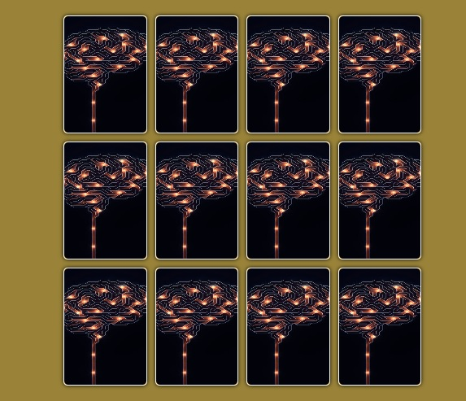

#  Brain Game - Memory Matching Cards

A fun and interactive memory card game built using **HTML**, **CSS**, and **JavaScript**. Flip the cards, match the pairs, and test your memory!

---

##  Features

-  Flip cards to find matching pairs.
-  Win condition after all cards are matched.
-  Cards auto-reset and shuffle after a win.
-  Responsive design with smooth flipping animation.

---

## Technologies Used

- **HTML**
- **CSS**
- **JavaScript**

---

## How to Play

1. Click on any card to flip it.
2. Try to find its matching pair.
3. Matched cards will stay flipped.
4. Win the game by matching all cards!

---

## Folder Structure

brain-game/
├── index.html
├── style.css
├── app.js
├── image/
│ ├── chess1.jpg
│ ├── chess2.jpg
│ ├── ...
│ └── background.jpg

---

##  Live Demo

[Play the Game Now](https://github.com/waleed39118/mindGame.git)  

---

## To-Do In The Features

- [ ] Add timer
- [ ] Add score tracker
- [ ] Add levels/difficulty
- [ ] Add sound effects

---

## Author

waleed39118

- GitHub: [@waleed30118](https://github.com/waleed39118/mindGame.git)

---

